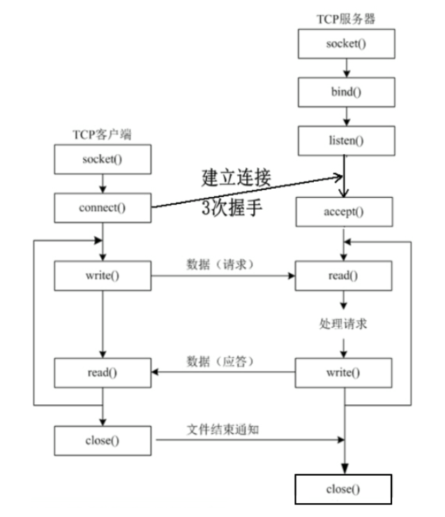
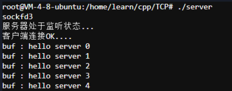
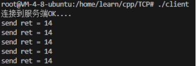

# TCP编程

## 1.TCP中的cs架构



## 2.TCP中的函数

### 2.1socket函数

**头文件：** `#include <sys/types.h>` `include <sys/socket.h>`
**函数：**`int socket(in domain,int type,int protocol);`
**功能：** 创建一个套接字
**参数：**

* domain:
  AF_INET 这是大多数用来产生socket的协议，使用TCP或UDP来传输，用IPv4的地址
  AF_INET6 与上面类似，不过是来用IPv6的地址
  AF_UNIX 本地协议，使用在Unix和Linux系统上，一般都是当客户端和服务器在同一台及其上的时候使用
* type:
  SOCK_STREAM 这个协议是按照顺序的、可靠的、数据完整的基于字节流的连接。这是一个使用最多的socket类型，这个socket是使用TCP来进行传输。
  SOCK_DGRAM 这个协议是无连接的、固定长度的传输调用。该协议是不可靠的，使用UDP来进行它的连接。
  SOCK_SEQPACKET该协议是双线路的、可靠的连接，发送固定长度的数据包进行传输。必须把这个包完整的接受才能进行读取。
  SOCK_RAW socket类型提供单一的网络访问，这个socket类型使用ICMP公共协议。（ping、traceroute使用该协议）
  SOCK_RDM 这个类型是很少使用的，在大部分的操作系统上没有实现，它是提供给数据链路层使用，不保证数据包的顺序
* protocol:
  传0表示使用默认协议。

**返回值:**  成功：返回指向新创建的socket的文件描述符，失败：返回-1，设置errno

### 2.2bind函数

**头文件：** `#include <sys/types.h>` `include <sys/socket.h>`
**函数：**`int bind(int sockfd,const struct sockaddr *addr,socklen_t addrlen);`
**功能：** 将套接字与地址绑定
**参数：**

* sockfd : socket文件描述符
* addr : 构造出ip地址加端口号
* addrlen : sizeof(sockaddr)长度

**返回值：** 成功返回0，失败返回-1

### 2.3listen函数

**头文件：** `#include <sys/types.h>` `include <sys/socket.h>`
**函数：**`int listen(int sockfd , int backlog)`
**功能：** 用于将套接字设置为监听模式，等待传入的连接请求。一旦套接字被设置为监听模式，它就可以使用accept函数来接受连接
**参数：**

* sockfd：文件描述符（套接字）
* backlog :这个参数定义了内核应该为相应套接字排队的最大连接数。注意，这个值并不保证你能够同时接受这么多连接，它只是一个提示给内核的。在大多数系统中，实际的最大连接数可能会比这个值小。

1. 未完成连接的队列 ：这是等待完成三次握手的连接请求队列。当一个客户端尝试连接服务器时，服务器会先发送一个 SYN-ACK 响应，并等待客户端的 ACK 响应来完成三次握手。在这个 ACK 响应到达之前，这个连接请求会在这个队列中等待。
2. 已完成连接的队列 ：这是已经完成了三次握手，但还没有被`accept` 函数接受的连接队列。一旦有连接完成了三次握手，它就会从未完成连接的队列移动到已完成连接的队列，等待服务器通过`accept` 函数来接受它。

**返回值：** 如果 `listen` 函数成功，它返回 0。如果失败，它返回 -1，并设置全局变量 `errno` 来指示错误

### 2.4accept函数

**头文件：** `#include <sys/types.h>` `include <sys/socket.h>`
**函数：**`int accept(int sockfd , struct sockaddr *addr , socklen_t *addrlen)`
**功能：** 用于等待并接受一个客户端的连接
**参数：**

* sockfd：文件描述符（套接字）
* addr：传出参数，返回链接客户端地址信息，含IP地址和端口号
* addrlen:传入传出参数，函数返回时返回真正接收到地址结构体的大小

**返回值：** 返回一个新的socket文件描述符，用于和客户端通信，失败返回-1，设置errno

### 2.5connect函数

**头文件：** `#include <sys/types.h>` `include <sys/socket.h>`
**函数：**`int connect(int sockfd , const struct sockaddr *addr , socklen_t addrlen)`
**功能：** connect函数用于客户端，它尝试由addr参数指定的服务器建立连接。这个函数会阻塞直到连接建立或出错
**参数：**

* sockfd：文件描述符（套接字）
* addr：传入参数，指定服务器端地址信息，含IP地址和端口号
* addrlen:传入传出参数，传入struct sockaddr的大小

**返回值：** 成功返回0，失败返回-1

### 2.6recv函数

**头文件：** `#include <sys/types.h>` `include <sys/socket.h>`
**函数：**`ssize_t recv(int sockfd , void *buf , size_t len , int flags)`
**功能：** recv函数用于从已连接的套接字接收数据
**参数：**

* sockfd：文件描述符（套接字）
* buf：接收数据缓存
* len：buf的长度
* flags：接收数据的标志，一般默认为0

**注意：**

* `recv` 函数是阻塞的，这意味着如果当前没有数据可读，它将等待直到有数据到来或者发生错误。在某些情况下，你可能希望使用非阻塞的套接字，这可以通过设置套接字的选项来实现。
* `recv` 函数并不保证一次性读取请求长度的所有数据。它可能返回小于请求长度的数据，特别是当对方发送的数据量少于请求量时。因此，应用程序通常需要在循环中调用`recv`，直到读取到所需的数据量或者发生错误。
* 在使用 TCP 套接字时，`recv` 函数按照数据流的顺序返回数据。但是，在使用 UDP 套接字时，`recv` 函数可能返回乱序的数据包，因为 UDP 不保证数据包的顺序。

**返回值：**
成功：实际读到的数据的字节数，如果对方已经关闭了 返回0表示读到结尾
失败：-1

### 2.7send函数

**头文件：** `#include <sys/types.h>` `include <sys/socket.h>`
**函数：**`ssize_t send(int sockfd , const void *buf , size_t len , int flag)`
**功能：** send函数用于在已连接的套接字上发送数据
**参数：**

* sockfd：文件描述符（套接字）
* buf：发送的数据
* len：发送数据的长度
* flags：发送数据的标志，一般默认为0

**返回值：**
成功：非零值  实际发送数据的字节数
失败：-1

**注意：**

* `send` 函数并不保证一次性发送所有请求长度的数据。它可能返回比请求长度更少的字节数，特别是在网络拥塞或对方接收缓冲区已满的情况下。因此，应用程序通常需要在一个循环中调用`send`，直到所有数据都被发送或发生错误。
* `send` 函数是阻塞的，这意味着如果数据不能立即发送（例如，由于网络拥塞），它将等待直到数据被发送或者发生错误。在某些情况下，你可能希望使用非阻塞的套接字，这可以通过设置套接字的选项来实现。
* `send` 函数在 TCP 套接字上使用时，会按照应用程序指定的顺序发送数据，并且会保证数据的完整性和顺序性。然而，在 UDP 套接字上使用时，`send` 函数只负责将数据发送到网络层，并不保证数据的到达顺序或可靠性。

### 2.8TCP 服务端

```cpp
#include <cstring>
#include "iostream"
#include <cstdio>
#include <cstdlib>
#include <sys/types.h>
#include <sys/socket.h>
#include <arpa/inet.h>
#include <unistd.h>

using namespace std;

#define SIZE 128


//TCP服务端
int main(void){
    int ret = -1;
    int sockfd = -1;
    int connfd = -1;

    char buf[SIZE];

    struct sockaddr_in addr;
    struct sockaddr_in from;

    socklen_t len = sizeof(from);

    //创建套接字
    sockfd = socket(AF_INET , SOCK_STREAM,0);

    if (sockfd == -1)
    {
        perror("socket");
        return 1;
    }

    cout << "sockfd" << sockfd << endl;

    //绑定
    memset(&addr,0,sizeof(addr));
    addr.sin_family = AF_INET;
    addr.sin_port = htons(8081);

    inet_pton(AF_INET,"127.0.0.1",&addr.sin_addr);

    ret = bind(sockfd,(struct sockaddr*)&addr,sizeof(addr));
    if(ret == -1){
        perror("bind");
        return 1;
    }

    //监听
    ret = listen(sockfd,10);   //将服务器套接字设置为监听模式
    if (ret == -1)
    {
        perror("listen");
        return 1;
    }

    cout << "服务器处于监听状态..."<< endl;

    //接受客户端连接
    //sockfd是接受客户端连接的套接字
    connfd = accept(sockfd , (struct sockaddr*)&from , &len);   //connfd是与客户端进行数据交互的套接字
    if (connfd == -1)
    {
        perror("accept");
        return 1;
    }

    cout << "客户端连接OK...."<< endl;

    //进行数据交互
    while (1)
    {
        memset(buf,0,SIZE);
        ret = read(connfd,buf,SIZE);
        if (ret <= 0)
        {
            break;
        }
        cout << "buf : " << buf << endl;
    }

    //断开连接
    close(connfd);
    close(sockfd);

    return 0;
  
  
}
```

运行效果：



### 2.9TCP客户端

```cpp
#include "cstdio"
#include "cstring"
#include "cstdlib"
#include "sys/types.h"
#include "sys/socket.h"
#include "arpa/inet.h"
#include "unistd.h"
#include "iostream"
#define SIZE 128

using namespace std;

int main(void){
  
    int i = 0;
    int ret = -1;
    int sockfd = -1;


    char buf[SIZE];

    struct sockaddr_in addr;

    //创建套接字
    sockfd = socket(AF_INET,SOCK_STREAM,0);
    if(sockfd == -1){
        perror("socket");
        return 1;
    }

    //连接到服务端
    memset(&addr,0,sizeof(addr));
    addr.sin_family = AF_INET;
    addr.sin_port = htons(8081);

    inet_pton(AF_INET,"127.0.0.1",&addr.sin_addr);
    ret = connect(sockfd,(struct sockaddr*)&addr,sizeof(addr));
    if (ret == -1)
    {
        perror("connect");
        return 1;
    }

    cout << "连接到服务端OK...." << endl;

    //数据交互
    for (int i = 0; i < 5; i++)
    {
        memset(buf,0,SIZE);
        sprintf(buf,"hello server %d",i);
        ret = write(sockfd,buf,strlen(buf));
  
        cout << "send ret = " << ret << endl;
        sleep(1);

  
  
    }
  
    //断开连接
        close(sockfd);
        return 0;


}
```

运行效果图：
