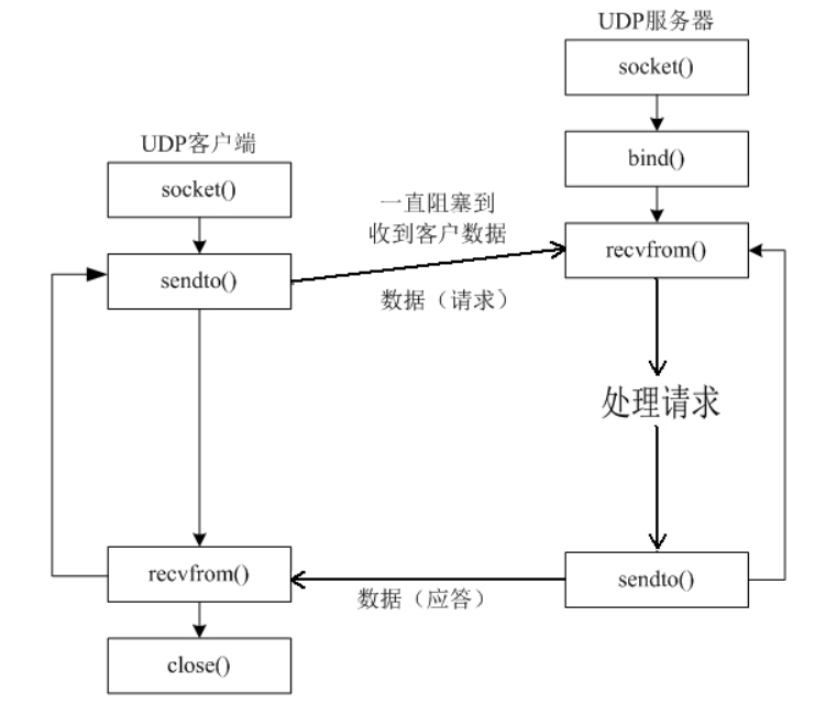

# UDP编程

## 1.udp结构图



## 2.sendto函数

**头文件：**`#include <sys/types.h>`  `#include <sys/socket.h>`

**功能：** 向to结构体中指定的ip发送udp数据，可以发送0长度的udp数据包
**函数：**

```cpp
ssize_t sendto (int sockfd , const void *buf , size_t len , int flags , const struct sockaddr *to , socklen_t addrlen);
//sockfd ：套接字
//buf：发送数据缓存区
//len ：发送数据缓存区的大小
//flags：一般为0
//to：指向目的主机地址结构体的指针
//addrlen：to 所指向内容的长度
```

**返回值**：成功返回数据的长度
失败返回-1

## 3.bind函数

**头文件：**`#include <sys/types.h>`  `#include <sys/socket.h>`
**功能：**：将本地协议地址与sockfd绑定，这样ip、port就固定了
**函数:**

```cpp
int bind(int sockfd , const struct sockaddr *addr , socklen_t addrlen);
//sockfd：socked套接字
//addr：指向特定协议的地址结构指针
//addrlen：该地址结构的长度
```

**返回值：**成功返回0 ， 失败返回-1
**测试代码：**

```cpp
#include "iostream"
#include "sys/types.h"
#include "sys/socket.h"
#include "arpa/inet.h"
#include "string.h"
using namespace std;

int main(){

    //本地网络
    struct sockaddr_in my_addr;
    bzero(&my_addr,sizeof(my_addr));  //清空结构体内容
    my_addr.sin_family = AF_INET;
    my_addr.sin_port = htons(8080);
  
    //绑定网卡所有ip地址
    my_addr.sin_addr.s_addr = htonl(INADDR_ANY);

    printf("Binding server to port %d\n",my_addr.sin_port);
    int err_log;
    int sockfd = socket(AF_INET,SOCK_DGRAM,0);  //创建udp套接字
    err_log = bind(sockfd,(struct sockaddr *)&my_addr,sizeof(my_addr));  //绑定udp套接字
    if (err_log != 0)
    {
        //cout << err_log << endl;
        perror("bind");

    }
  
}
```

**运行结果：**

```shell
root@VM-4-8-ubuntu:/home/learn/cpp# ./a.out 
Binding server to port 36895
```

## 4.recvfrom

以下是 `recvfrom` 函数的基本语法（以 C 语言为例）：

```c
#include <sys/socket.h>    ssize_t recvfrom(int sockfd, void *buf, size_t len, int flags,                   struct sockaddr *src_addr, socklen_t *addrlen);
```

参数说明：

1. `sockfd`：这是一个指向已连接或未连接的 socket 的文件描述符。
2. `buf`：这是一个指向缓冲区的指针，用于存储接收到的数据。
3. `len`：指定`buf` 的大小，即最大可接收的字节数。
4. `flags`：这个参数可以影响函数的行为。对于 UDP，它通常是 0。
5. `src_addr`：这是一个指向`sockaddr` 结构体的指针，该结构体在函数返回时将包含发送方的地址信息。如果对此不感兴趣，可以将其设置为 NULL。
6. `addrlen`：这是一个指向`socklen_t` 类型变量的指针，它应该包含`src_addr` 结构体的大小。在函数返回时，它将被更新为实际存储的地址信息的大小。

`recvfrom` 函数返回接收到的字节数，如果出现错误则返回 -1。

以下是一个简单的 UDP 接收数据的示例：

```c
#include <stdio.h>  #include <stdlib.h>  #include <string.h>  #include <sys/socket.h>  #include <netinet/in.h>  #include <arpa/inet.h>    #define BUF_SIZE 1024    int main() {      int sockfd;      struct sockaddr_in server_addr, client_addr;      char buffer[BUF_SIZE];      socklen_t addrlen = sizeof(client_addr);        // 创建一个 UDP socket      if ((sockfd = socket(AF_INET, SOCK_DGRAM, 0)) < 0) {          perror("socket creation failed");          exit(EXIT_FAILURE);      }        // 设置服务器地址信息      memset(&server_addr, 0, sizeof(server_addr));      server_addr.sin_family = AF_INET;      server_addr.sin_addr.s_addr = INADDR_ANY;      server_addr.sin_port = htons(12345);        // 绑定 socket 到服务器地址      if (bind(sockfd, (const struct sockaddr *)&server_addr, sizeof(server_addr)) < 0) {          perror("bind failed");          exit(EXIT_FAILURE);      }        // 接收数据      ssize_t n = recvfrom(sockfd, buffer, BUF_SIZE, 0, (struct sockaddr*)&client_addr, &addrlen);      if (n < 0) {          perror("recvfrom failed");          exit(EXIT_FAILURE);      }        // 打印接收到的数据和发送方的地址信息      printf("Received %zd bytes from %s:%d\n", n, inet_ntoa(client_addr.sin_addr), ntohs(client_addr.sin_port));      printf("Data: %s\n", buffer);        close(sockfd);      return 0;  }
```

注意：在实际应用中，应该处理更多的错误情况，并且可能需要循环接收数据，直到满足某种条件为止。此外，`inet_ntoa` 函数不是线程安全的，因此在多线程环境中应该使用 `inet_ntop` 函数。

## 5.UDP编程示例：

### 5.1UDP通信客户端

```cpp
#include "stdio.h"
#include "stdlib.h"
#include "string.h"
#include "unistd.h"
#include "sys/socket.h"
#include "netinet/in.h"
#include "arpa/inet.h"
#include "iostream"

using namespace std;

int main(int argc , char *argv[]){
    unsigned short port = 8081;
    char *server_ip = "127.0.0.1";

    if (argc > 1)
    {
        server_ip = argv[1];
    }

    if (argc > 2)
    {
        port = atoi(argv[2]);
    }

    int sockfd;
    sockfd = socket(AF_INET,SOCK_DGRAM,0);   //创建UDP套接字
    if (sockfd < 0)
    {
        perror("socket");
        exit(-1);
    }

    //套接字地址
    struct sockaddr_in dest_addr;
    bzero(&dest_addr,sizeof(dest_addr));
    dest_addr.sin_family = AF_INET;    //ipv4地址协议
    dest_addr.sin_port = htons(port);
    inet_pton(AF_INET,server_ip,&dest_addr.sin_addr);    //将地址的字符串转换为整型

    cout << "send data to UDP server" << server_ip << " : " << port << endl;

    while (1)
    {
        char send_buf[512] = "";
        fgets(send_buf,sizeof(send_buf),stdin);   //获取输入
        send_buf[strlen(send_buf) - 1] = '\0';

        //发送数据
        int len = sendto(sockfd,send_buf,strlen(send_buf),0,(struct sockaddr*)&dest_addr,sizeof(dest_addr));
        cout << "len = " << len << endl;
    }

    close(sockfd);
    return 0;
  


  
}
```

### 5.2UDP通信服务端

```cpp
#include "stdio.h"
#include "stdlib.h"
#include "string"
#include "unistd.h"
#include "sys/socket.h"
#include "netinet/in.h"
#include "arpa/inet.h"
#include "iostream"

using namespace std;

int main(int argc , char *argv[]){
    unsigned short port = 8081;
    if (argc > 1)
    {
        port = atoi(argv[1]);
    }

    int sockfd;
    sockfd = socket(AF_INET,SOCK_DGRAM,0);
    if (sockfd < 0)
    {
        perror("socket");
        exit(-1);
    }
  
    cout << "receive data..."<<endl;

    while (1)
    {
        int recv_len;
        char recv_buf[512] = "";
        struct sockaddr_in client_addr;
        char cli_ip[INET_ADDRSTRLEN] = "";
        socklen_t cliaddr_len = sizeof(client_addr);

        //接受数据
        recv_len = recvfrom(sockfd,recv_buf,sizeof(recv_buf),0,(struct sockaddr*)&client_addr,&cliaddr_len);   //这个函数会阻塞，直到接收到数据为止
        inet_ntop(AF_INET,&client_addr.sin_addr,cli_ip,INET_ADDRSTRLEN);
        cout << "ip : " << cli_ip << "port : " << ntohs(client_addr.sin_port)<<endl;
        cout << "data ( " << recv_len << ") : " << recv_buf << endl;
    }

    close(sockfd);
    return 0;
  
  

}